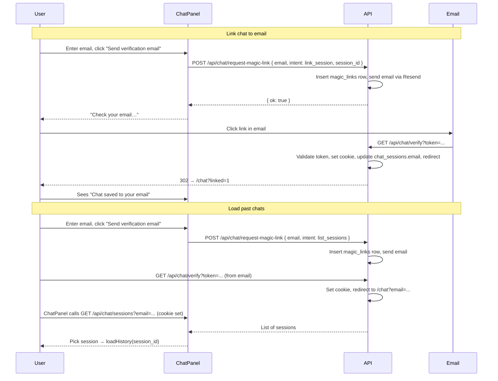

# Chat history by email (with magic-link verification)

## Overview

Add optional email to chat sessions so users can link the current conversation to their email and later restore past chats by entering the same email. **Access is gated by magic-link verification**: the user must click a one-time link sent to their email before they can link a session or list/load past chats. After verification, a signed cookie allows them to use "link" and "list sessions" for that email for a set period (e.g. 24 hours) without re-verifying.

---

## Part 1: Schema and core APIs (unchanged from original)

- **Schema** [app/server/db/schema.ts](app/server/db/schema.ts): Add `email: text('email')` (nullable) to `chatSessions`. New migration: `ALTER TABLE chat_sessions ADD COLUMN email TEXT;`
- **Link API** `app/server/api/chat/link.post.ts`: Body `{ session_id, email }`. Validate email. Update `chat_sessions` set `email` where `session_id`. **From Part 2 onward, this endpoint must require a verified-email cookie matching the request body email.**
- **List sessions API** `app/server/api/chat/sessions.get.ts`: Query `email`. Return sessions for that email ordered by `updated_at` desc. **Must require verified-email cookie matching the requested email.**

---

## Part 2: Magic-link verification

### 2.1 New schema and migration

- **Table `magic_links`** (in [app/server/db/schema.ts](app/server/db/schema.ts)):
  - `id` (PK, autoIncrement)
  - `token` (text, unique, notNull) — e.g. 32-byte hex or `crypto.randomUUID()`
  - `email` (text, notNull)
  - `intent` (text, notNull) — `'link_session'` | `'list_sessions'`
  - `sessionId` (text, nullable) — required when intent is `link_session`
  - `createdAt` (timestamp)
  - `expiresAt` (timestamp) — e.g. created + 15 minutes

- New Drizzle migration: create `magic_links` table.

### 2.2 Config

- **Base URL for magic links**: Add to [nuxt.config.ts](nuxt.config.ts) `runtimeConfig`: e.g. `appBaseUrl: process.env.NUXT_APP_BASE_URL || 'http://localhost:3000'` (and optionally a secret for signing the cookie, e.g. `cookieSecret: process.env.NUXT_COOKIE_SECRET`). Document in `.env.example`: `NUXT_APP_BASE_URL=https://your-site.pages.dev` and `NUXT_COOKIE_SECRET=` (random string for signing the verified-email cookie).

### 2.3 Request magic link (send email)

- **New:** `app/server/api/chat/request-magic-link.post.ts`
  - Body: `{ email: string, intent: 'link_session' | 'list_sessions', session_id?: string }`.
  - Validate email (same regex as quote flow). If `intent === 'link_session'`, require `session_id` and optionally verify that session exists.
  - Generate token (e.g. `crypto.randomUUID()` or 32 bytes hex), insert into `magic_links` with `expiresAt = now + 15 min`.
  - Build link: `{{appBaseUrl}}/api/chat/verify?token={{token}}`.
  - Send email via Resend (same `resendApiKey` / `resendFromEmail` as [app/server/api/quote.post.ts](app/server/api/quote.post.ts)): to `email`, subject like "Verify your email for Carport Picker chat", body: "Click to verify: [link]. Link expires in 15 minutes."
  - Return `{ ok: true }` (do not return the token). If Resend is not configured, return a clear error or skip send and still create the token so dev can use the link from logs if needed.

### 2.4 Verify magic link (GET: set cookie + redirect)

- **New:** `app/server/api/chat/verify.get.ts`
  - Query: `token` (required).
  - Look up row in `magic_links` where `token = :token` and `expiresAt > now`. If missing or expired, return 400 and a simple HTML or redirect to `/chat?error=expired`.
  - Read `email`, `intent`, `sessionId` from the row. Delete the row (one-time use).
  - **Set verified-email cookie**: Signed cookie so the client cannot forge it. Options: (a) use Nitro/h3 `setCookie` with a signed value (e.g. sign `email + expiry` with `cookieSecret` using HMAC or encode a small JWT with `jose`), or (b) store a verification session id in DB and put that id in the cookie. Recommended: signed payload `{ email, exp }` (exp = now + 24h) in a cookie named e.g. `carport_verified_email`, HttpOnly, Secure in prod, SameSite=Lax, Max-Age=86400.
  - If `intent === 'link_session'` and `sessionId`: update `chat_sessions` set `email = :email`, `updated_at = now()` where `session_id = :sessionId`.
  - Redirect: `302` to `/chat` (and optionally `?linked=1` when intent was link_session, or `?email=...` when intent was list_sessions so the UI can auto-fill and fetch sessions). Use `sendRedirect(event, url)`.

### 2.5 Shared verification helper

- **New:** `app/server/utils/verifiedEmail.ts` (or inline in the two API files):
  - `getVerifiedEmail(event): string | null` — read the verified-email cookie, verify signature, check expiry, return email or null.
  - Use this in `GET /api/chat/sessions` and `POST /api/chat/link`: require `getVerifiedEmail(event) === requestedEmail`, else 401.

### 2.6 Protect link and list endpoints

- In `app/server/api/chat/link.post.ts`: After validating body `email` and `session_id`, require `getVerifiedEmail(event) === email`. If not, return 401 with message like "Please verify your email first by clicking the link we sent you."
- In `app/server/api/chat/sessions.get.ts`: Require `getVerifiedEmail(event) === query.email`. If not, return 401.

---

## Part 3: Frontend flow

### 3.1 Request magic link (no direct link/list yet)

- **ChatPanel** (and useChat) do **not** call link or list sessions directly when the user clicks "Save this chat" or "Load my chats". Instead:
  - **Save this chat to my email**: User enters email, clicks "Send verification email" (or "Save this chat") → `POST /api/chat/request-magic-link` with `{ email, intent: 'link_session', session_id: sessionId }`. Show: "Check your email and click the link to save this chat to your email."
  - **Load my chats**: User enters email, clicks "Send verification email" (or "Load my chats") → `POST /api/chat/request-magic-link` with `{ email, intent: 'list_sessions' }`. Show: "Check your email and click the link to view your past chats."

### 3.2 After user clicks the magic link

- User lands on `/api/chat/verify?token=...` → server sets cookie and redirects to `/chat?linked=1` or `/chat?email=...`.
- **If `?linked=1`**: ChatPanel can show a short success message: "This chat is now saved to your email."
- **If `?email=...`**: ChatPanel can pre-fill the email field and either auto-call `GET /api/chat/sessions?email=...` (cookie is now set, so request will succeed) and show the list of past sessions, or show a "Load my chats" button that now works without sending another email.

### 3.3 useChat additions

- `requestMagicLink(payload: { email: string, intent: 'link_session' | 'list_sessions', session_id?: string })` → POST `/api/chat/request-magic-link`, handle errors and success message.
- `fetchSessionsByEmail(email)` and `linkSessionToEmail(email)` remain but are only called after verification (e.g. after redirect with cookie set). The UI can disable "Load my chats" list or "Save this chat" until the user has verified (cookie present). Optional: add a small API `GET /api/chat/verified-email` that returns `{ email: string } | null` based on the cookie so the UI can show "Verified as …" and allow list/link without re-sending the magic link.

---

## Part 4: Data flow (with magic link)

---

## Part 5: Files to add or change (summary)

| Action | File |
|--------|------|
| Edit | [app/server/db/schema.ts](app/server/db/schema.ts) — add `email` to `chatSessions`; add table `magic_links` |
| Add | Migration: add `email` to `chat_sessions`; create `magic_links` table |
| Add | [app/server/utils/verifiedEmail.ts](app/server/utils/verifiedEmail.ts) — read/verify signed cookie, return email or null |
| Add | [app/server/api/chat/request-magic-link.post.ts](app/server/api/chat/request-magic-link.post.ts) — create token, send email |
| Add | [app/server/api/chat/verify.get.ts](app/server/api/chat/verify.get.ts) — validate token, set cookie, link session if intent, redirect |
| Add | [app/server/api/chat/link.post.ts](app/server/api/chat/link.post.ts) — require verified cookie, then update session email |
| Add | [app/server/api/chat/sessions.get.ts](app/server/api/chat/sessions.get.ts) — require verified cookie, then return sessions by email |
| Edit | [nuxt.config.ts](nuxt.config.ts) — add `appBaseUrl`, `cookieSecret` to runtimeConfig |
| Edit | [.env.example](.env.example) — document `NUXT_APP_BASE_URL`, `NUXT_COOKIE_SECRET` |
| Edit | [app/composables/useChat.ts](app/composables/useChat.ts) — add `requestMagicLink`; keep `linkSessionToEmail`, `fetchSessionsByEmail` for after-verify use |
| Edit | [app/components/ChatPanel.vue](app/components/ChatPanel.vue) — two-step UI: request magic link first; after redirect, show "Load my chats" / "Save this chat" using cookie-backed APIs |
| Optional | [app/server/api/chat/verified-email.get.ts](app/server/api/chat/verified-email.get.ts) — return current verified email from cookie so UI can show "Verified as …" and skip re-verification |

---

## Security and edge cases

- **One-time tokens**: Delete (or mark used) the `magic_links` row when the verify endpoint is consumed so the link cannot be reused.
- **Token expiry**: 15 minutes is typical; reject expired tokens with a clear message or redirect.
- **Cookie signing**: Use a server secret so the client cannot set or tamper with `carport_verified_email`. Validate expiry (e.g. 24h) when reading.
- **Rate limiting**: Consider rate-limiting `request-magic-link` by IP or email to prevent abuse and email enumeration.
- **Resend**: If `RESEND_API_KEY` is missing, either skip sending and still create the token (dev) or return 503; document behavior.

No changes to Turso/libSQL or Cloudflare Workers beyond the new table and endpoints; existing [app/server/utils/db.ts](app/server/utils/db.ts) and Resend usage stay the same.
